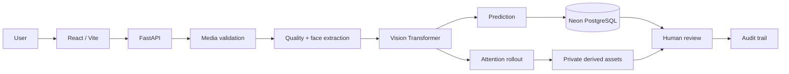

# DeepFake Sentinel

**Vision Transformer-Based Deepfake Detection and Forged-Region Highlighting**

DeepFake Sentinel is a full-stack media-forensics screening platform for images and short videos. It validates real uploads, calculates input-quality signals, runs a configurable Hugging Face Vision Transformer, derives attention-rollout evidence from the model's tensors, persists the result, and keeps the final review decision human.

> This is decision support—not an authenticity oracle. Model scores and attention overlays can be wrong and must not be the sole basis for consequential decisions.

## Product flow



The core principle is **input → model signal → visual evidence → human decision**. Authenticated screens do not contain fabricated analytics, scores, histories, or heatmaps. When the configured detector is unavailable, the analysis fails explicitly and no substitute result is generated.

## Key capabilities

- JWT registration, login, current-user lookup, protected routes, and backend ownership checks
- Actual image decoding and video inspection—not MIME-only validation
- Configurable image/video limits, safe filenames, SHA-256 traceability, and duplicate awareness
- Singleton Hugging Face `AutoModelForImageClassification` with CPU, CUDA, and MPS selection
- Face-aware inference through OpenCV with an explicitly recorded full-frame fallback
- Resolution, blur, brightness, contrast, and face-availability quality signals
- Inconclusive band with versioned thresholds and optional temperature calibration
- ViT attention rollout rendered as grayscale attention, color heatmap, and overlay assets
- Uniform short-video frame sampling, frame-level prediction/evidence, and trimmed-mean aggregation
- Persisted analysis stages and SSE/polling-compatible events
- Independent human decisions and notes that never overwrite the model output
- Evidence-grounded OpenRouter explanation; structured deterministic fallback on provider failure
- Dashboard, history, evidence explorer, AI analyst, audit timeline, and model-information surfaces
- Private local storage abstraction and configurable source-media retention
- Reproducible training, evaluation, and calibration utilities without bundled datasets or invented metrics

## Technology

Frontend: React 19, TypeScript, Vite, Tailwind CSS, Framer Motion, React Router, TanStack Query, React Hook Form, Zod, Lucide, Recharts, Three.js, React Three Fiber, and Drei.

Backend: Python 3.11+, FastAPI, Pydantic v2, SQLAlchemy 2, Alembic, PostgreSQL/Neon, PyTorch, torchvision, Transformers, OpenCV, Pillow, NumPy, scikit-learn, httpx, JWT, and Argon2 password hashing.

## Directory structure

```text
DeepFake-Sentinel/
├── frontend/
│   ├── public/visuals/
│   ├── src/components/
│   ├── src/lib/
│   ├── src/pages/
│   ├── Dockerfile
│   └── vercel.json
├── backend/
│   ├── alembic/versions/
│   ├── app/api/routes/
│   ├── app/ml/calibration/
│   ├── app/services/
│   ├── ml_training/
│   ├── tests/
│   ├── Dockerfile
│   └── railway.toml
├── docs/
├── examples/
├── .env.example
└── docker-compose.yml
```

## Model and evidence pipeline

The default model identifier is `hamzenium/ViT-Deepfake-Classifier`; replace it through `DEEPFAKE_MODEL_ID` or provide a local compatible checkpoint through `DEEPFAKE_MODEL_CHECKPOINT`. The loader verifies that the label mapping contains a manipulated/fake class before it can return a result.

For each image, the service decodes the media, extracts the largest valid padded face crop when available, computes quality signals, applies the configured image processor, and evaluates the ViT. A model that does not expose usable attention tensors can still produce a classification, but evidence is marked unavailable rather than fabricated.

Attention rollout averages heads, adds residual identity, normalizes each layer, recursively multiplies attention matrices, extracts CLS-to-patch influence, infers the spatial token grid from the token count, resizes it to the analysed crop, and renders private evidence assets. The overlay indicates influence, not a segmentation mask.

For video, the service validates duration and metadata, samples 8–24 representative frames (depending on duration, mode, and configured cap), processes each frame, and persists its timestamp, quality, probabilities, classification, and evidence availability. Overall fake probability is a deterministic 10% trimmed mean when enough frames exist. Fewer than three usable scores is always `INCONCLUSIVE`.

## Database

SQLAlchemy models and the initial Alembic migration create:

`users`, `analyses`, `analysis_media`, `analysis_events`, `video_frames`, `predictions`, `quality_signals`, `evidence_maps`, `human_reviews`, `review_notes`, `ai_explanations`, `model_metadata`, and `audit_logs`.

Each historical analysis stores its model identifier/version, thresholds, evidence method, and application version. Changing the configured model affects only new runs.

### Neon setup

1. Create a Neon project and copy its pooled PostgreSQL connection string.
2. Copy `.env.example` to `.env` and set `DATABASE_URL` (use the `postgresql+psycopg://` SQLAlchemy scheme when needed).
3. Set a strong random `JWT_SECRET` of at least 32 characters.
4. From `backend`, run `alembic upgrade head`.

SQLite is used only as a zero-configuration local development fallback when `DATABASE_URL` is empty. Production should use Neon.

## Local setup

### Backend

```bash
cd backend
python -m venv .venv
# Windows: .venv\Scripts\activate
# macOS/Linux: source .venv/bin/activate
pip install -r requirements.txt
alembic upgrade head
uvicorn app.main:app --reload --port 8000
```

The first real analysis may download the configured detector. Set `MODEL_LOCAL_ONLY=true` for an offline deployment with a pre-provisioned checkpoint. `GET /api/v1/system/model?load=true` explicitly attempts a model load; the normal status request does not trigger a download.

### Frontend

```bash
cd frontend
cp .env.example .env
npm install
npm run dev
```

Open `http://localhost:5173`. The API runs at `http://localhost:8000`, and its interactive documentation is available at `/docs`.

## Environment variables

The root `.env.example` documents all settings. Important groups are:

- Database/auth: `DATABASE_URL`, `JWT_SECRET`, `JWT_ALGORITHM`, `ACCESS_TOKEN_MINUTES`
- Origins: `FRONTEND_URL` (comma-separated exact origins; never wildcarded with credentials)
- Detector: `DEEPFAKE_MODEL_ID`, `DEEPFAKE_MODEL_CHECKPOINT`, `MODEL_DEVICE`, `MODEL_LOCAL_ONLY`
- Interpretation: `AUTHENTIC_THRESHOLD`, `MANIPULATED_THRESHOLD`, `CALIBRATION_ARTIFACT`
- Media: `MAX_IMAGE_MB`, `MAX_VIDEO_MB`, `MAX_VIDEO_SECONDS`, `MAX_VIDEO_FRAMES`
- Capacity: `MAX_CONCURRENT_INFERENCE`
- Storage: `STORAGE_PROVIDER`, `STORAGE_ROOT`, `STORE_ORIGINAL_MEDIA`
- Explanation: `OPENROUTER_API_KEY`, `OPENROUTER_MODEL`, `OPENROUTER_BASE_URL`
- Frontend: `VITE_API_URL`

Never put `OPENROUTER_API_KEY`, database credentials, JWT secrets, or checkpoint paths in frontend variables.

## API overview

```text
POST   /api/v1/auth/register
POST   /api/v1/auth/login
GET    /api/v1/auth/me
POST   /api/v1/analyses/image
POST   /api/v1/analyses/video
GET    /api/v1/analyses
GET    /api/v1/analyses/{id}
GET    /api/v1/analyses/{id}/status
GET    /api/v1/analyses/{id}/events
GET    /api/v1/analyses/{id}/events/stream
GET    /api/v1/analyses/{id}/frames
GET    /api/v1/analyses/{id}/evidence
POST   /api/v1/analyses/{id}/review
POST   /api/v1/analyses/{id}/notes
DELETE /api/v1/analyses/{id}
POST   /api/v1/ai/explain
POST   /api/v1/ai/summarize
POST   /api/v1/ai/ask
GET    /api/v1/dashboard
GET    /api/v1/audit
GET    /api/v1/system/model
GET    /health
```

Private preview, attention, heatmap, overlay, and frame routes require the owning user's bearer token.

## OpenRouter grounding and privacy

OpenRouter is never the detector. The optional explanation service receives only structured detector results, quality measurements, evidence availability, frame aggregates, and textual human review context. It is explicitly instructed not to change the classification, invent evidence, claim forensic certainty, or call an attention region forged. Raw image/video bytes are never included.

If OpenRouter is not configured, times out, or returns malformed output, the analysis remains usable and a deterministic cautionary explanation is returned. Pydantic validates structured responses and one repair retry is permitted.

## Training and evaluation

Place licensed data outside source control using:

```text
dataset/
├── train/{real,fake}/
├── val/{real,fake}/
└── test/{real,fake}/
```

See `backend/ml_training/README.md`. The scripts support transfer learning, AdamW, cosine scheduling, mixed precision, early stopping, checkpoint/config/label persistence, accuracy, precision, recall, F1, ROC-AUC, confusion matrix, false-positive rate, false-negative rate, and optional temperature calibration. No evaluation metric is pre-populated.

## Tests and quality checks

```bash
cd backend
pytest
RUN_MODEL_INTEGRATION=1 pytest tests/test_model_integration.py

cd ../frontend
npm run build
npm run lint
```

Unit tests use mocked or mathematical ML boundaries and do not report synthetic detector performance. The explicit integration flag downloads/runs the configured real detector.

## Docker

```bash
cp .env.example .env
docker compose up --build
```

Neon remains external. The backend image includes OpenCV runtime libraries and exposes a health check. Private derived assets use a named Docker volume.

## Deployment

### Vercel frontend

Set the root directory to `frontend`, build command to `npm run build`, output directory to `dist`, and `VITE_API_URL` to the Railway API URL ending in `/api/v1`. `vercel.json` provides SPA rewrites.

### Railway backend

Deploy `backend` with its Dockerfile. Configure every required secret, the Neon connection string, and the exact Vercel origin in `FRONTEND_URL`. Railway binds `$PORT`; `railway.toml` checks `/health`. A base ViT plus PyTorch can require substantial memory, so size the container from measured cold-load and inference use rather than assuming an entry-level instance is sufficient.

For durable production media retention, implement the provided storage boundary with an S3-compatible private bucket. Ephemeral Railway disks are not durable storage.

## Known limitations

- Background processing uses FastAPI background tasks inside one API service. Move the processor boundary to Redis/Celery or another durable queue for multi-instance production.
- Local private storage is appropriate for development, not durable multi-instance hosting.
- OpenCV Haar face detection is intentionally replaceable and less robust than a modern detector.
- Model probabilities are not described as calibrated unless a valid calibration artifact is loaded.
- Actual performance depends entirely on the configured checkpoint, its training data, and the target media distribution.
- Video sampling is designed for short prototype clips, not long-form media.
- Attention rollout is model influence, not ground-truth forged-region segmentation.

## Future improvements

Durable job queues, S3 storage, stronger face tracking, temporal deepfake architectures, per-source calibration, ONNX inference, signed asset URLs, administrator model governance, analysis comparison, case export, and formal chain-of-custody workflows are natural next steps.

## Responsible use

See [`docs/RESPONSIBLE_USE.md`](docs/RESPONSIBLE_USE.md). Preserve original source material separately when expert examination or legal chain-of-custody is required.

